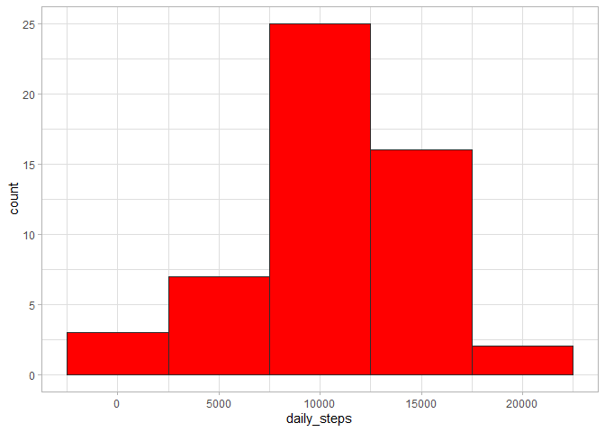
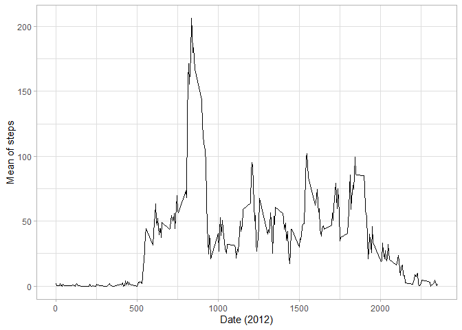
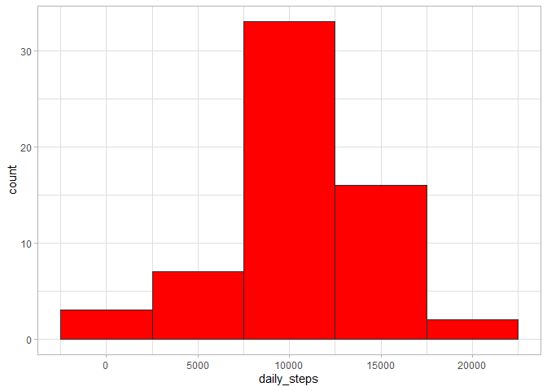
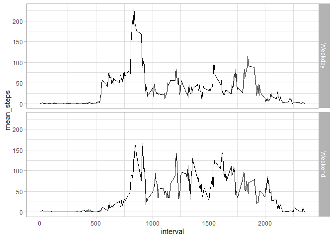

## Loading and preprocessing the data
Questions: 

  - Code for reading in the dataset and/or processing the data
  

```r
library(tidyverse)   # for the data analysis.
library(lubridate)  # for date analysis.
activity <- read.csv("activity.csv") %>%
  mutate(date = as.Date(date))
```


## What is mean total number of steps taken per day?
Questions:

 - Histogram of the total number of steps taken each day
 
 - Mean and median number of steps taken each day
 

```r
activity %>%
  group_by(date) %>%
  summarise(mean_steps = mean(steps, na.rm = TRUE), median_steps = median(steps)) %>%
  ungroup()
```

```
## # A tibble: 61 x 3
##    date       mean_steps median_steps
##    <date>          <dbl>        <dbl>
##  1 2012-10-01    NaN               NA
##  2 2012-10-02      0.438            0
##  3 2012-10-03     39.4              0
##  4 2012-10-04     42.1              0
##  5 2012-10-05     46.2              0
##  6 2012-10-06     53.5              0
##  7 2012-10-07     38.2              0
##  8 2012-10-08    NaN               NA
##  9 2012-10-09     44.5              0
## 10 2012-10-10     34.4              0
## # ... with 51 more rows
```

Histogram:


```r
activity %>% 
  group_by(date) %>%
  summarise(daily_steps = sum(steps)) %>%
  ungroup() %>%
  ggplot(aes(x = daily_steps)) + 
  geom_histogram(binwidth = 4999, fill = "red", color = "#2D2D2D") + 
  theme_light()
```

```
## `summarise()` ungrouping output (override with `.groups` argument)
```

```
## Warning: Removed 8 rows containing non-finite values (stat_bin).
```

<!-- -->


## What is the average daily activity pattern?

Questions:

  - Time series plot of the average number of steps taken
  
  - The 5-minute interval that, on average, contains the maximum number of steps

Time plot series:


```r
activity %>% 
  group_by(interval) %>%
  summarise(mean_steps = mean(steps, na.rm = TRUE)) %>%
  ungroup() %>%
  ggplot(aes(x = interval, y = mean_steps)) + 
  geom_line() + 
  theme_light() + 
  labs(y = "Mean of steps", x = "Date (2012)")
```

<!-- -->
Interval with the maximum number of steps


```r
activity %>% 
  group_by(interval) %>%
  summarise(steps = mean(steps, na.rm = TRUE)) %>%
  pull(steps) %>%
  max(na.rm = TRUE) -> steps_extreme


activity %>%
  group_by(interval) %>%
  summarise(steps = mean(steps, na.rm = TRUE)) %>%
  filter(steps == steps_extreme)
```

```
## # A tibble: 1 x 2
##   interval steps
##      <int> <dbl>
## 1      835  206.
```

```r
# the 5-minute interval of number 835 has, on average, the maximum number of steps.
```

## Imputing missing values

Rows with missing values:


```r
activity %>%
  filter(is.na(steps)) %>%
  nrow()
```

```
## [1] 2304
```

To fill the missing values, we can add the mean grouped by the `interval` variable; i.e., when tha value is NA, we select all values which have the same label for identification.


```r
data_filled <- activity

for(index in unique(activity[["interval"]])){
  index_activity <- activity %>% 
    filter(interval == index)
  index_mean <- mean(index_activity[["steps"]], na.rm = TRUE)

  rows <- which(data_filled[["interval"]] == index)
  
  for(label_row in rows){
    if(is.na(data_filled[["steps"]][label_row])){
      data_filled[["steps"]][label_row] <- index_mean
      
    }
  }
}
```

Histograms of `data_filled`:

```r
data_filled %>%
  group_by(date) %>%
  summarise(daily_steps = sum(steps)) %>%
  ungroup() %>%
  ggplot(aes(x = daily_steps)) + 
  geom_histogram(fill = "red", color = "#2D2D2D", binwidth = 4999) + 
  theme_light()
```

<!-- -->

Mean and median of `data_filled`.


```r
data_filled %>%
  group_by(date) %>%
  summarise(mean = mean(steps), median = median(steps)) %>%
  ungroup()
```

```
## # A tibble: 61 x 3
##    date         mean median
##    <date>      <dbl>  <dbl>
##  1 2012-10-01 37.4     34.1
##  2 2012-10-02  0.438    0  
##  3 2012-10-03 39.4      0  
##  4 2012-10-04 42.1      0  
##  5 2012-10-05 46.2      0  
##  6 2012-10-06 53.5      0  
##  7 2012-10-07 38.2      0  
##  8 2012-10-08 37.4     34.1
##  9 2012-10-09 44.5      0  
## 10 2012-10-10 34.4      0  
## # ... with 51 more rows
```

We hadd NaN or NA values for median and for mean before inputing the missing values; now, we have a real number in it. 

## Are there differences in activity patterns between weekdays and weekends?

There is a slightly difference, as the plot shows.

```r
data_filled %>%
  mutate(isweekend = ifelse(weekdays(date) %in% c("sábado", "domingo"), "Weekend", "Weekday")) %>% 
  group_by(interval, isweekend) %>% 
  summarise(mean_steps = mean(steps)) %>%
  ungroup() %>%
  ggplot() + 
  geom_line(aes(x = interval, y = mean_steps, group = isweekend)) + 
  theme_light() + 
  facet_grid(isweekend~.)
```

<!-- -->
